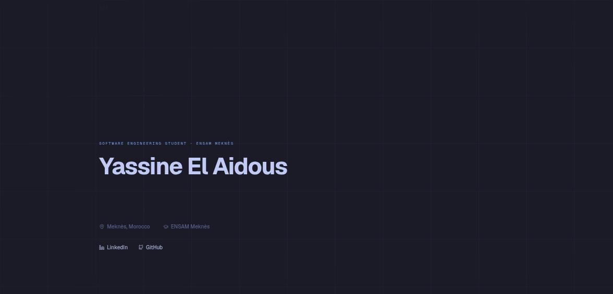
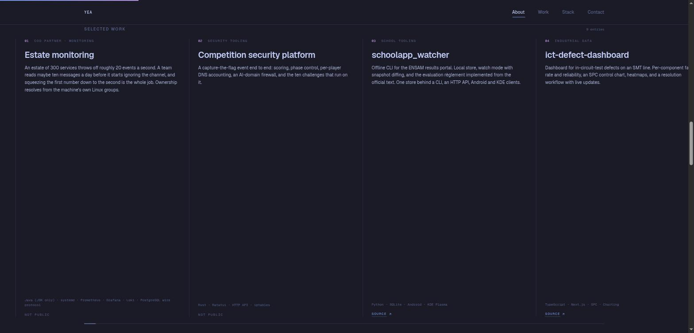

# Portfolio

The personal site at [yassine-elaidous.vercel.app](https://yassine-elaidous.vercel.app).
Next.js 14, Tailwind and framer-motion, Tokyo Night palette, with the work
section scrolling sideways as the page scrolls down.



Everything the page renders comes from `lib/content.ts` rather than from the
components, so adding a project or changing a blurb is one file.



The work section measures its own overflow instead of guessing a percentage, so
the track lands on the last card at every breakpoint. Projects that are not
public say so instead of linking nowhere, and the one project with a recording
plays it on the card, muted and looping, falling back to a poster frame when
the visitor has asked for reduced motion.

## Running it

```bash
npm install
npm run dev
```

## Deploying

Git auto-deploy is not connected, so production goes out from the CLI:

```bash
vercel deploy --prod --scope elaidousyassine-4202s-projects
```
